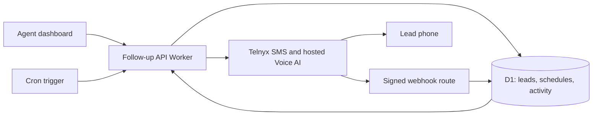

# Low-Cost Follow-Up Pilot Architecture

Status: Core stack accepted; the synthetic backend flow passes in the local Cloudflare Python Worker runtime with D1 and native WebCrypto. Full CRM features and cloud deployment are not implemented.
Updated: 2026-09-21. Provider prices and limits checked on this date.

## Confirmed requirements

- One monorepo with independently deployable frontend and backend.
- Agent follow-up first, with automatic tracking of SMS and Voice AI activity.
- Minimize initial and ongoing costs; use Cloudflare free hosting where practical.
- The owner has access to a Telnyx API key and reports $300 in Telnyx credits. Account permissions, credit eligibility/expiry, numbers, and registrations have not been inspected.

## Accepted stack and supporting proposals

| Component | Choice | Reason |
| --- | --- | --- |
| Frontend | React, TypeScript, Vite; static Cloudflare Pages deployment | Lightweight agent dashboard; no server rendering needed for a private CRM |
| Backend | Python with FastAPI on one Cloudflare Python Worker | Owner prefers Python; separate API deployment with modules for leads, cadences, delivery, and callbacks |
| Database | Cloudflare D1; versioned SQL migrations and prepared queries | Managed relational storage without an always-on database server |
| Scheduling | Cron wake-up and indexed, durable jobs in D1 | Schedules survive restarts; bounded work per invocation |
| Communications | Telnyx SMS and hosted Voice AI | One provider; Telnyx runs the live audio conversation |
| Pilot login | Cloudflare Access with named, allowlisted users | Low-cost internal pilot authentication; server verifies tokens and membership |
| API contract | FastAPI OpenAPI schema and generated TypeScript client | Python schemas remain authoritative; frontend consumes a generated contract |

The frontend and backend deploy separately from the same repository. Start with one follow-up backend service; lead generation, recruitment, and the broader CRM can become separate services later. SMS and voice are adapters within the follow-up service initially.

Cloudflare Access is a pilot authentication proposal, not the final public SaaS signup system. Prove the frontend-to-API session flow early. Use a same-origin API route on an existing domain if available, or explicitly configure authenticated cross-origin requests. Public Telnyx callback routes must be reachable without browser login and independently verify provider signatures.

## Backend language and hosting decision

Accepted on 2026-09-21: use Python/FastAPI because the owner is more comfortable maintaining Python. Keep React/TypeScript for the frontend. Select Cloudflare Workers and D1 as the initial backend hosting/data target; do not provision an Oracle VM for the initial pilot.

Cloudflare supports [FastAPI](https://developers.cloudflare.com/workers/languages/python/packages/fastapi/) through its Python Workers ASGI integration. Its [Python runtime](https://developers.cloudflare.com/workers/languages/python/how-python-workers-work/) uses Pyodide/WebAssembly, so dependency support and CPU usage must be validated rather than assuming a conventional Linux Python environment.

Keep business logic separate from D1, scheduled-event, and Telnyx adapters. If runtime validation fails, retain Python and revisit hosting. FastAPI can move to a conventional container/VM, but Cloudflare bindings and scheduler integration will need replacement. No hosting fallback has been selected or provisioned.

Use FastAPI/Pydantic models as the API schema source and generate a TypeScript client for the frontend. Check generated-contract drift in CI when code is introduced. Do not duplicate business logic across Python and TypeScript.

## Cloudflare container option

Cloudflare also supports Linux containers, separate from Python Workers. Containers require Workers Paid (starting at $5/month), with included allowances and usage charges for compute, memory, disk, and related services. They can sleep when idle, but are not a free-tier deployment option. A container would provide a conventional FastAPI runtime if Python Worker compatibility becomes a blocker; it is not the selected deployment target. [Container overview](https://developers.cloudflare.com/containers/), [pricing](https://developers.cloudflare.com/containers/platform/pricing/).

Keep durable lead data and schedules outside any container filesystem. If the hosting target changes, explicitly validate database access, scheduled execution, and recovery rather than assuming Worker bindings work unchanged inside a container.

## Proposed layout

```text
apps/web/                    React agent dashboard
services/agent-followup/      Worker API, scheduler, provider adapters, migrations
packages/api-client/         TypeScript client generated from FastAPI OpenAPI
infra/                       Deployment notes and service-specific configuration
```

The follow-up service contains the initial backend validation code. The frontend and generated client directories are future work.

## Flow



The Worker starts a call and returns; Telnyx handles the conversation and sends events back. Do not stream live audio through the dashboard or the Worker.

## Pilot experience

Recommended default while lead-source input is pending: one dispatch company, named dispatchers, manual lead entry and CSV import. Preserve `source_system` and `external_lead_id` for future CRM integration.

1. Agent creates/imports a lead, assigns an owner, and records channel eligibility and contact timezone.
2. Agent enrolls the lead in a simple follow-up sequence and reviews the first outreach.
3. Due SMS and voice steps execute once automation is enabled and the lead remains eligible.
4. A lead timeline shows sent/delivered/failed SMS, replies, call status, available call summaries, and the next scheduled action.
5. Replies, opt-outs, agent takeover, or a completed outcome pause/cancel future steps as appropriate.
6. Agents can pause, resume, assign, and mark follow-ups complete. The dashboard highlights overdue, failed, and uncertain deliveries.

Start with one editable sequence, template SMS, and a short Voice AI follow-up step. A proposed example is an initial SMS, a later voice check-in if unanswered and voice-eligible, then a final SMS. Timing and scripts remain configurable and must be agreed before live use. Email and WhatsApp are later adapters.

## Data and ownership

Suggested entities: companies, memberships, leads, consent records, sequence versions, enrollments, scheduled jobs, delivery attempts, provider events, activity entries, and usage reservations.

Every business record has a company/tenant identifier. Resolve membership from the verified session and enforce role/assignment checks in each query; D1 does not supply automatic tenant isolation. Store the minimum lead/contact data needed for follow-up. A future core CRM can become the canonical lead store through an explicit API/event integration.

Store timestamps in UTC plus the lead's IANA timezone. Evaluate allowed contact windows in the lead's timezone, including daylight-saving transitions. Use immutable sequence versions so edits do not silently change active enrollments.

## Reliable scheduling and delivery

- Treat Cron as a wake-up, not as the durable schedule. Index pending jobs by status and due time; use small bounded batches and conditional claims with leases.
- Recheck pause status, suppression, consent/channel eligibility, operating hours, and spending allowance just before dispatch.
- Persist a unique dispatch attempt before contacting Telnyx. Verify provider idempotency separately for SMS and voice endpoints during implementation.
- A timeout may occur after Telnyx accepts a request. Mark uncertain outcomes for reconciliation; never blindly resend. Job claims alone do not guarantee exactly-once external delivery.
- Deduplicate callbacks by provider event ID. Handle out-of-order status updates without regressing terminal states.
- Persist inbound reply/opt-out state before optional AI analysis. A provider-accepted message or call may still complete even after later cancellation.
- Acknowledge callbacks only after durable processing/recording; let failed persistence trigger provider retry. Monitor missed/overdue jobs and reconciliation backlog.

Cloudflare Queues is available on the free plan, so it is an optional next step if execution bursts justify it. D1 must remain the durable source for multi-day schedules: the free queue retention is only 24 hours. A queue's at-least-once delivery still requires deduplication. [Queues pricing](https://developers.cloudflare.com/queues/platform/pricing/).

## Cost model

Start on free Cloudflare plans and measure real usage. Free hosting is a target for a small pilot, not a promise at every volume.

| Item | Current published allowance/rate | Implication |
| --- | --- | --- |
| Static Pages | Free static requests; 500 builds/month on Free | Dashboard hosting can start at $0 |
| Worker | 100,000 requests/day; 10 ms CPU/invocation on Free | Benchmark JWT/signature verification and bounded scheduler batches |
| D1 | 5 million rows read/day; 100,000 rows written/day; 5 GB total Free storage | Use indexes and pagination; one Free database is capped at 500 MB |
| Access | Free plan for small teams under 50 users | Suitable candidate for an internal dispatch-team pilot |
| Telnyx Voice AI | $0.05/minute voice engine, plus LLM and telephony | Actual cost depends on outbound route, model, duration rounding, and features |
| Telnyx US SMS | From $0.004 per message segment, plus carrier fees | Count segments rather than assuming one text equals one billable unit |

Sources: [Pages routing](https://developers.cloudflare.com/pages/functions/routing/), [Pages limits](https://developers.cloudflare.com/pages/platform/limits/), [Workers pricing](https://developers.cloudflare.com/workers/platform/pricing/), [Workers limits](https://developers.cloudflare.com/workers/platform/limits/), [D1 pricing](https://developers.cloudflare.com/d1/platform/pricing/), [D1 limits](https://developers.cloudflare.com/d1/platform/limits/), [Access pricing](https://www.cloudflare.com/sase/products/access/), [Telnyx Voice AI pricing](https://telnyx.com/pricing/voice-ai-agents), [Telnyx SMS pricing](https://telnyx.com/pricing/messaging).

Illustration, not an all-in quote: 2,000 outbound SMS segments at the starting rate contribute $8; 300 billable Voice AI engine minutes contribute $15. The $23 subtotal excludes carrier fees, LLM tokens, telephony/platform charges, incoming messages, number rental, registration/campaign fees, optional features, and taxes. Account-specific pricing may differ. The API key itself does not imply free communications.

The published Voice AI engine rounds per call to 60-second increments. Avoid estimating costs from aggregate raw seconds alone. Start with pay-as-you-go; the memo's proposed unlimited pricing is not a confirmed account entitlement.

Keep an upgrade path to Workers Paid, which starts at $5/month plus applicable overages. Free Worker CPU and D1 limits can stop processing; monitor these and load-test before accepting a live outreach workload.

## Available pilot credit

The owner reports $300 of Telnyx credit. Treat this as a finite testing/pilot allowance, not a recurring budget or verified cash balance. Confirm expiration and which charges qualify before relying on it.

Proposed rollout: start with an estimated $25 test allowance, then an additional $75 pilot allowance after reviewing actual costs and outcomes; keep the remaining $200 unallocated until usage is understood. These are proposed application controls, not spending authorization or configured provider limits. Once credits run out, usage can incur cash charges.

## Controls that keep costs low

- Template-based SMS for routine steps; no LLM call on every scheduler tick.
- Short Voice AI instructions with only relevant lead context, plus maximum call duration and attempt limits.
- Atomic daily usage reservations before dispatch, conservative estimates, and reconciliation against actual provider usage. Application estimates are not a guaranteed cap on the provider invoice.
- Per-company pause switch, daily SMS and call-minute allowances, and a recipient allowlist in test mode.
- Store statuses and useful summaries first. Recording storage is an optional later feature, with explicit retention decisions.
- No always-on servers, Redis, Kubernetes, vector database, or separate paid automation platform in the pilot.

## Security and integration prerequisites

Keep the Telnyx key in backend secrets only. Never put it in frontend environment variables, browser requests, or committed files. Validate inputs, verify webhook signatures against raw bodies, restrict browser origins, protect session-based writes from CSRF, rate-limit write/send actions, and exclude lead content from logs.

Before live outreach, verify the account's messaging/voice configuration, number ownership, required messaging registration, consent flow, and approved scripts. Implement opt-out handling and human handoff as product behavior. No API key, provider account, phone number, or registration was changed during this planning work.

## Build sequence and acceptance criteria

1. Runtime validation first: an authenticated FastAPI endpoint writes/reads a synthetic record through D1, performs a simulated Telnyx request, and processes a signed synthetic provider webhook. Verify invalid identity/signature rejection, event deduplication, and Python package compatibility. Measure CPU in a Cloudflare staging environment when deployment is configured; local results alone cannot establish free-tier suitability. No paid calls/messages are needed for this milestone.
2. Separate frontend/backend workspaces, local development, generated OpenAPI client, D1 schema, named-user authentication, and synthetic test fixtures.
3. Lead list/detail, agent assignment, timeline, sequence enrollment, pause/resume, and a fake-provider scheduler. Verify two workers cannot claim one job and tenant boundaries hold.
4. Telnyx SMS adapter and signed callbacks. Verify duplicate callbacks, delivery failure, uncertain timeout outcomes, STOP/reply cancellation, and budget reservations.
5. Telnyx hosted Voice AI adapter using the same execution framework. Verify call outcomes, timeout/reconciliation, duration caps, and human handoff.
6. Cloudflare staging deployment, recipient-allowlisted validation, free-tier CPU/query measurements, then the initial live pilot once operational prerequisites are met.

Use TDD for executable code, unit/integration tests and critical Playwright flows, with at least 80% coverage. Provider tests mock paid outbound actions by default.

## Input still needed

- Lead source: our dashboard first or Follow Up Boss integration.
- Expected agents and new leads/month; provisional sizing is a small single-company pilot.
- Monthly communications budget, first sequence, and desired SMS/voice balance.
- Cloudflare account/domain and Telnyx configuration details when deployment/integration begins.
